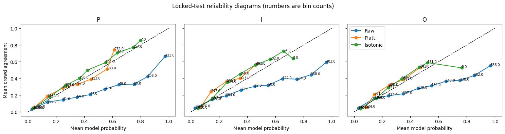

# Medical Abstract PIO Classifier

Fine-tuning PubMedBERT to identify **Population (P)**, **Intervention (I)** and
**Outcome (O)** information in individual sentences, with post-hoc calibration
to predict crowd-annotator agreement. A sentence can receive multiple labels or none.

[Open notebook in Colab](https://colab.research.google.com/github/farshadofficial/medical-abstract-pio-classifier/blob/main/picos_model_demo.ipynb)
· [Download trained model](https://github.com/farshadofficial/medical-abstract-pio-classifier/releases/download/v0.1.0/picos_model_and_results.zip)
· [Research release v0.1.0](https://github.com/farshadofficial/medical-abstract-pio-classifier/releases/tag/v0.1.0)

## Motivation

A healthcare question rarely has its answer in a single research paper. Doctors and researchers conduct **systematic reviews** to bring together evidence from many studies. They often use the [PICO framework](https://www.cochrane.org/authors/handbooks-and-manuals/handbook/current/chapter-02) to organise their questions around four key details:

- **Population:** Who was studied?
- **Intervention:** What treatment was tested?
- **Comparison:** What was it compared with?
- **Outcome:** What results were measured?

Finding these details across many research papers takes time and careful reading. I built this project to explore whether AI could help with that process by identifying relevant sentences in medical abstracts—the short summaries at the beginning of research papers. The model focuses on three parts of the framework: **Population, Intervention, and Outcome**.

People can also disagree about which sentences describe these details. I wanted to explore whether the model’s scores could reflect that disagreement, adding another layer to understanding its predictions.

This project connects a real research task with practical AI development. I prepared the data, trained the model, evaluated its predictions, and created a demo that others can try. The longer-term aim is to help readers find relevant information more easily while keeping the original text available for their own judgment.

## Results

Evaluation covers **2,075 sentences from 191 documents**, separate from this run's
training, validation and calibration. Validation micro-F1 selected the epoch-2
checkpoint: **0.8087**.

| Element | Expert precision | Expert recall | Expert F1 | Raw agreement MSE | Isotonic agreement MSE |
| --- | ---: | ---: | ---: | ---: | ---: |
| Population | 0.8046 | 0.9156 | 0.8565 | 0.0608 | 0.0175 |
| Intervention | 0.9166 | 0.7993 | 0.8539 | 0.0730 | 0.0201 |
| Outcome | 0.9320 | 0.7947 | 0.8578 | 0.1003 | 0.0227 |

Expert classification uses raw scores at **0.5**, compared with expert-majority
sentence-presence labels; ties are negative. Agreement MSE uses fractional crowd
votes. Calibrated agreement scores are not probabilities of classifier correctness.

Both calibration methods reduced agreement MSE for all three elements, with positive
95% document-bootstrap improvement intervals against raw scores. These intervals
do not compare isotonic and logistic calibration directly.

[Expert classification report](locked_test_expert_binary_metrics.csv)
· [Agreement calibration report](locked_test_calibration_metrics.csv)
· [Bootstrap comparisons](locked_test_bootstrap_mse_delta.csv)

The preserved figure calls the logistic method “Platt.” Here it uses probability
inputs, rather than logits as in conventional Platt scaling.

## Try the saved model without retraining

1. Download [picos_model_and_results.zip](https://github.com/farshadofficial/medical-abstract-pio-classifier/releases/download/v0.1.0/picos_model_and_results.zip).
   Keep this filename and leave it zipped: approximately 407 MB (388 MiB).
2. [Open the notebook in Colab](https://colab.research.google.com/github/farshadofficial/medical-abstract-pio-classifier/blob/main/picos_model_demo.ipynb).
   Setup requires Python **3.11 or 3.12**. The recorded runtime was **2026.07**,
   with Python **3.12.13**. A GPU is optional for inference.
3. Run the installation cell once, then restart the session. Skip that cell after
   restarting. **Setup still reports conflicts with Colab's preinstalled packages;
   see the verification limits below.**
4. Upload the model ZIP through Colab's Files panel into the working directory,
   normally `/content`.
5. Skip directly to **Example predictions on new text**, near the bottom, and run
   its code cell. It loads the model without dataset downloads or retraining.
6. Replace the example sentences with your own individual sentences.

The demo reports labels, raw scores and truncation at **128 tokens**. Checked examples:

| Sentence | Predicted labels |
| --- | --- |
| We enrolled 120 adults with type 2 diabetes. | P |
| Participants received metformin or placebo for twelve weeks. | I |
| The primary outcome was the change in HbA1c at twelve weeks. | O |
| Metformin reduced HbA1c compared with placebo. | I, O |

The release contains the classifier, tokenizer, agreement calibrators, metadata,
checksums and upstream attribution. This demo uses raw classifier scores. Inputs
are individual sentences; it does not split whole abstracts or highlight phrases.

## Training and evaluation

The notebook uses EBM-NLP annotations and fixed document-level partitions:

| Partition | Documents | Sentences |
| --- | ---: | ---: |
| Base training | 3,592 | 38,147 |
| Base validation | 490 | 5,344 |
| Calibration | 720 | 7,670 |
| Test | 191 | 2,075 |

Validation selects the checkpoint; calibration documents fit logistic and isotonic
mappings. Test documents are excluded from fitting and checkpoint selection.
Evaluation includes classification metrics, agreement MSE/MAE/ECE and **2,000
document-bootstrap resamples**.

For a full run, use a fresh work directory: existing extracted dataset contents
are not independently checksum-verified. Run setup once, restart, then run from
the imports cell downward. Recorded training used an **A100**, four epochs and seed
**20260806**; BF16 is enabled when supported.

Recorded versions: [requirements.txt](requirements.txt) and
[run_metadata.json](run_metadata.json). Exact partitions:
[document_splits.json](document_splits.json). Checkpoint selection:
[training_history.json](training_history.json).

## Scope and verification

Sentence-level P/I/O classification is demonstrated; Comparison/Study Design models,
phrase extraction, reliable ambiguity detection and clinical utility are not.
Heuristic sentence boundaries and truncation can affect results. Disagreement can
reflect boundary choices or missed mentions as well as ambiguity.

The test corpus had been examined in earlier project work; this is not an unseen
external evaluation. Bootstrap intervals condition on the fitted model and
calibrators, without retraining uncertainty. Seeds do not guarantee identical results.

Recorded outputs come from a completed Colab run. After cleanup, the saved-model
demo matched all four original labels and scores to four decimal places in a
restarted session. **The edited full experiment has not been rerun end to end.
Installation conflicts remain unresolved despite successful inference.**

## References and provenance

- [EBM-NLP corpus paper — Nye et al., ACL 2018](https://aclanthology.org/P18-1019/)
- [EBM-NLP source repository](https://github.com/bepnye/EBM-NLP), revision
  `43a4a1ea3f0a21cfb8820c040b843dfaf66192d0`.
- [Microsoft PubMedBERT / BiomedBERT model card](https://huggingface.co/microsoft/BiomedNLP-BiomedBERT-base-uncased-abstract-fulltext).
  The run used `microsoft/BiomedNLP-PubMedBERT-base-uncased-abstract-fulltext`, revision
  `e1354b7a3a09615f6aba48dfad4b7a613eef7062`.
